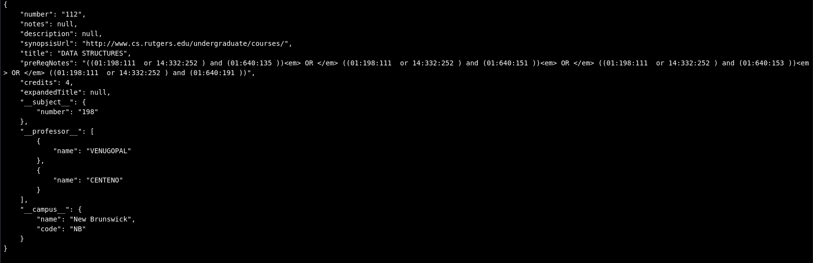
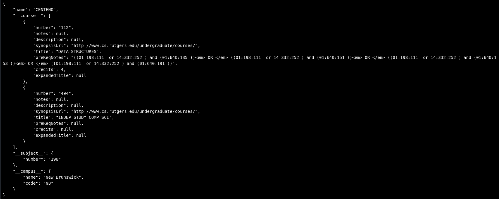

# Meeting 6

## Updates

Wrote SOC API Parser to follow JSON mapping, allowing for easier changes and additions.

Changes to the DB Schema shouldn't require changes to the code base    
And if they do they should be very small.

Instead changes or new collections can be added to the JSON Mapping and will automatically be picked up by the parser.

### Mappings

```JSON
{
    "<collection_name_1>" : {
        "parent_keys" : [
            "<parent_key_1>",
            "<parent_key_2>",
            "<parent_key_3>",
        ],
        "keys" : {
            "<key_name_1>" : {
                "new_key" : "<new_key>",
                "key_mod_method" : "<key_mod_method_name_1>",
                "value_mappings" : {
                    "<SOC_val_1>" : "<NEW_API_val_1>",
                    "<SOC_val_2>" : "<NEW_API_val_2>",
                },
                "augmented_keys" : ["<augmented_key_1>", "<augmented_key_2>"],
            },
            "<key_name_2>" : {
                "new_key" : "<new_key>",
                "key_mod_method" : "<key_mod_method_name_1>",
                "value_mappings" : {
                    "<SOC_val_1>" : "<NEW_API_val_1>",
                    "<SOC_val_2>" : "<NEW_API_val_2>",
                },
                "augmented_keys" : ["<augmented_key_1>", "<augmented_key_2>"],
            },
        },
    },
}
```
- Collection Name *Required*
  - Parent Keys (Location of key inside nested SOC JSON)   
    *Key is only present if they are required*   
    *Absent Key is equivalent to 'parent_keys : None'*   
    *In order they will be counter in tree/dict*   
  - Keys (SOC -> New API) *SHOULD NEVER BE NONE*   
    *Value is only present if they are required*   
    *Absent Value is equivalent to '"new_key" : None,"value_mappings" : None'*   
      - Name (Data Name inside SOC JSON)
      - Key Mod Method (Method name that properly formats key data)
      - Mapping (New Mapped Name of Data)   
       *Key is only present if they are required*   
        *Absent Key is equivalent to 'value_mappings : None'*
      - Augmented Keys (Additional names for this key)

**Issues**   
*Key Levels*   
  - Nesting Issues that share references could become an issue.
    - ex: Times and instructors
     - both nested at the section level
     - But not all instructors have the same times.   

*Lots of data to handle later on*   
  - Hopefully the schema and mod method can account for this.
  - Time modifications
  - Sub campuses
  - Majors
  - Minors
  - etc.
*Need to have a better way of handling mod methods*

## DB
DB-PoC population is successful.   
Reference Links are successful.

## Connection & Parser
*Needs to be modularized*   
Almost all of the course parsing, DB connection and pushing.       
Need to be modularized so that testing is easier and there is less mess with DB connections   

## Query
Expansions written

*Below is Output from a DB Query via Python:*    
Courses:    

Professors:    


Need to write more complex query handlers and define structure.

Determine endpoint handling (Replicate DB Project?)
